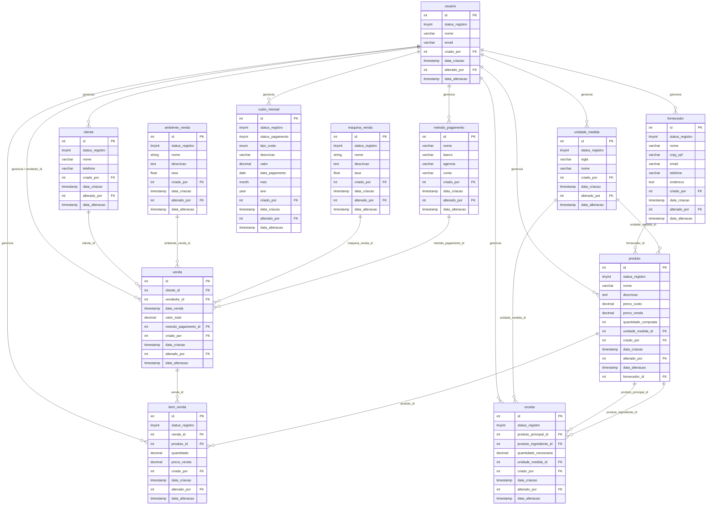

```mermaid
    erDiagram

    usuario ||--o{ cliente : "gerencia"
    usuario ||--o{ fornecedor : "gerencia"
    usuario ||--o{ unidade_medida : "gerencia"
    usuario ||--o{ metodo_pagamento : "gerencia"
    usuario ||--o{ produto : "gerencia"
    usuario ||--o{ receita : "gerencia"
    usuario ||--o{ venda : "gerencia / vendedor_id"
    usuario ||--o{ item_venda : "gerencia"
    usuario ||--o{ custo_mensal : "gerencia"

    cliente ||--o{ venda : "cliente_id"
    ambiente_venda ||--o{ venda : "ambiente_venda_id"
    maquina_venda ||--o{ venda : "maquina_venda_id"
    fornecedor ||--o{ produto : "fornecedor_id"
    unidade_medida ||--o{ produto : "unidade_medida_id"
    unidade_medida ||--o{ receita : "unidade_medida_id"
    metodo_pagamento ||--o{ venda : "metodo_pagamento_id"
    venda ||--o{ item_venda : "venda_id"
    produto ||--o{ item_venda : "produto_id"
    produto ||--o{ receita : "produto_principal_id"
    produto ||--o{ receita : "produto_ingrediente_id"

    usuario {
        int id PK
        tinyint status_registro
        varchar nome
        varchar email
        int criado_por FK
        timestamp data_criacao
        int alterado_por FK
        timestamp data_alteracao
    }

    cliente {
        int id PK
        tinyint status_registro
        varchar nome
        varchar telefone
        int criado_por FK
        timestamp data_criacao
        int alterado_por FK
        timestamp data_alteracao
    }

    fornecedor {
        int id PK
        tinyint status_registro
        varchar nome
        varchar cnpj_cpf
        varchar email
        varchar telefone
        text endereco
        int criado_por FK
        timestamp data_criacao
        int alterado_por FK
        timestamp data_alteracao
    }

    unidade_medida {
        int id PK
        tinyint status_registro
        varchar sigla
        varchar nome
        int criado_por FK
        timestamp data_criacao
        int alterado_por FK
        timestamp data_alteracao
    }

    metodo_pagamento {
        int id PK
        varchar nome
        varchar banco
        varchar agencia
        varchar conta
        int criado_por FK
        timestamp data_criacao
        int alterado_por FK
        timestamp data_alteracao
    }

    produto {
        int id PK
        tinyint status_registro
        varchar nome
        text descricao
        decimal preco_custo
        decimal preco_venda
        int quantidade_comprada
        int unidade_medida_id FK
        int criado_por FK
        timestamp data_criacao
        int alterado_por FK
        timestamp data_alteracao
        int fornecedor_id FK
    }

    receita {
        int id PK
        tinyint status_registro
        int produto_principal_id FK
        int produto_ingrediente_id FK
        decimal quantidade_necessaria
        int unidade_medida_id FK
        int criado_por FK
        timestamp data_criacao
        int alterado_por FK
        timestamp data_alteracao
    }

    venda {
        int id PK
        int cliente_id FK
        int vendedor_id FK
        timestamp data_venda
        decimal valor_total
        int metodo_pagamento_id FK
        int criado_por FK
        timestamp data_criacao
        int alterado_por FK
        timestamp data_alteracao
    }

    item_venda {
        int id PK
        tinyint status_registro
        int venda_id FK
        int produto_id FK
        decimal quantidade
        decimal preco_venda
        int criado_por FK
        timestamp data_criacao
        int alterado_por FK
        timestamp data_alteracao
    }

    custo_mensal {
        int id PK
        tinyint status_registro
        tinyint status_pagamento
        enum tipo_custo
        varchar descricao
        decimal valor
        date data_pagamento
        month mes
        year ano
        int criado_por FK
        timestamp data_criacao
        int alterado_por FK
        timestamp data_alteracao
    }

    ambiente_venda {
        int id PK
        tinyint status_registro
        string nome
        text descricao
        float taxa
        int criado_por FK
        timestamp data_criacao
        int alterado_por FK
        timestamp data_alteracao
    } 

    maquina_venda {
        int id PK
        tinyint status_registro
        string nome
        text descricao
        float taxa
        int criado_por FK
        timestamp data_criacao
        int alterado_por FK
        timestamp data_alteracao
    }
```
